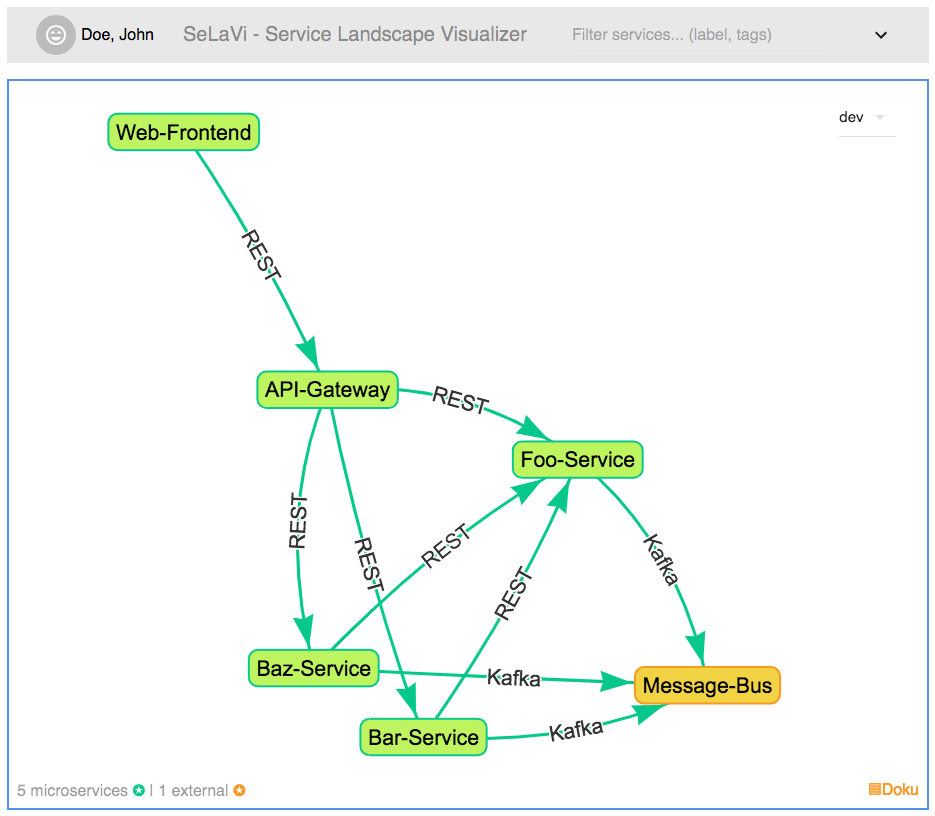

# SeLaVi
SeLaVi (ServiceLandscapeVisualizer) displays all microservices which are registered in a service registry and their relations to each other in a graphical mindmap.
This grants an overview over a complex system landscape for developers, operators and product owners alike.

### Demo System

You can have a look at SeLaVi on our CI system:

https://selavi.herokuapp.com/selavi

Note: The system might take a couple of seconds to respond because heroku puts it into hibernation after a certain amount of inactivity.

The graph is drawn using [vis.js](https://github.com/almende/vis "vis.js").

## When should you use SeLaVi?

* When you have a complex system landscape that is difficult to overview
* When you have the need to visualize dependencies between your services
* If you already have a Eureka service registry in operation, SeLaVi can easily be used on top of it

## Building the Application

It is possible to build the application with Maven.

### Maven

Make sure you have [Maven](http://maven.apache.org/ "Maven") installed (Version 3.1.0 or later).

### Running the Application with Maven

From the root folder of the application, execute:

	$ mvn spring-boot:run
	$ mvn spring-boot:run -Drun.jvmArguments=-Dspring.profiles.active=development-h2
	
### Running the Application with IntelliJ IDEA

Run the spring boot runner form IDEA with the VM options:
 
    $ -Dspring.profiles.active="development-h2" 

### Testing the application

    $ mvn clean verify

### Deploying the application

The WAR file created during the build process can be deployed in a Servlet Container, e.g. Apache Tomcat.

## Database options

The application can be run with a local H2 database or a MySQL database. A database user with alter table permission
is needed for the MySQL database

To run MySQL in docker container for local development, simply run

	$ docker pull mysql
	$ docker run --name docker-mysql -e MYSQL_ROOT_PASSWORD=root -e MYSQL_DATABASE=selavi -e MYSQL_USER=selavi -e MYSQL_PASSWORD=supersicher -d -p 3306:3306 mysql

### Spring Profiles
| Name | Description |
| ----------- | ----------- |
| local | all to localhost  |
| development-h2 | use H2 database|
| development-mysql | use local installed MySQL databse |

## Connection to Service Registry

It is possible to read microservices and their relations to each other from an Eureka serivce registry.

Therefore the link to the Eureka application interface has to be configured:

    selavi.registry.url.environment=https://registry-host/eureka/apps

## Watch mode (automatically re-build frontend sources when a file changes)

Run the spring boot app (see above), then run webpack in watch mode:

    $ node_modules/webpack/bin/webpack.js --watch
    
Now, as soon as a Javascript source file changes, the webpack bundle is re-build and deployed 

## Watch mode (frontend tests)

    $ npm run test
    
Launches the frontend test runner in watch mode, eg. re-running the tests automatically when a source (or test) file changes

## License

Copyright (c) 2017 dm-drogerie markt GmbH & Co. KG, https://dm.de

Permission is hereby granted, free of charge, to any person obtaining a copy
of this software and associated documentation files (the "Software"), to deal
in the Software without restriction, including without limitation the rights
to use, copy, modify, merge, publish, distribute, sublicense, and/or sell
copies of the Software, and to permit persons to whom the Software is
furnished to do so, subject to the following conditions:

The above copyright notice and this permission notice shall be included in all
copies or substantial portions of the Software.

THE SOFTWARE IS PROVIDED "AS IS", WITHOUT WARRANTY OF ANY KIND, EXPRESS OR
IMPLIED, INCLUDING BUT NOT LIMITED TO THE WARRANTIES OF MERCHANTABILITY,
FITNESS FOR A PARTICULAR PURPOSE AND NONINFRINGEMENT. IN NO EVENT SHALL THE
AUTHORS OR COPYRIGHT HOLDERS BE LIABLE FOR ANY CLAIM, DAMAGES OR OTHER
LIABILITY, WHETHER IN AN ACTION OF CONTRACT, TORT OR OTHERWISE, ARISING FROM,
OUT OF OR IN CONNECTION WITH THE SOFTWARE OR THE USE OR OTHER DEALINGS IN THE
SOFTWARE.